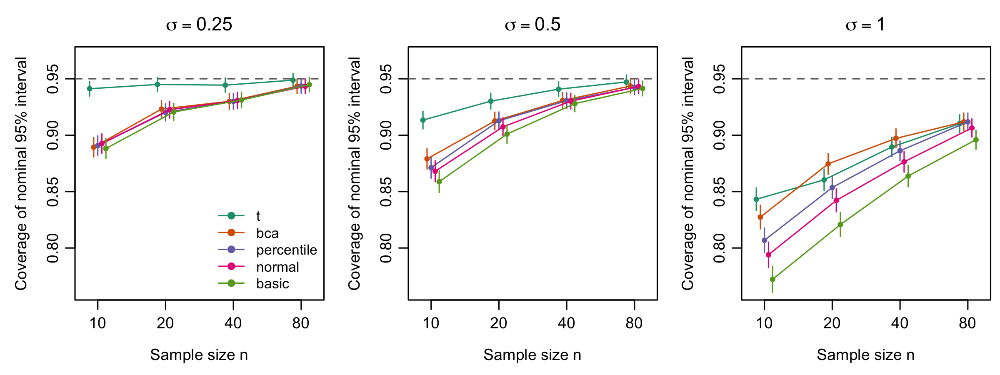
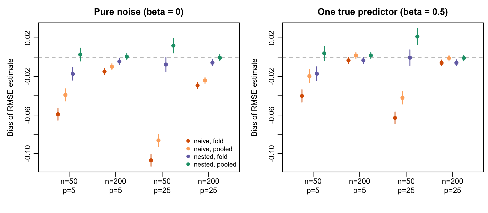

# RDataScienceCompendium

<!-- badges: start -->
[](https://github.com/SatvikPraveen/R-Data-Science-Compendium/actions/workflows/R-CMD-check.yaml)
[](https://github.com/SatvikPraveen/R-Data-Science-Compendium/actions/workflows/test-coverage.yaml)
[](https://github.com/SatvikPraveen/R-Data-Science-Compendium/actions/workflows/lint.yaml)
[](https://satvikpraveen.github.io/R-Data-Science-Compendium/)
[](LICENSE.md)
<!-- badges: end -->

**Reproducible resampling, simulation and model-evaluation methods for R,
packaged as a research compendium.**

The repository contains two things:

1. **An R package** of rigorously tested implementations of methods that
   underpin credible applied statistics. These are bootstrap confidence
   intervals, permutation tests, effect sizes with exact intervals, a
   framework for simulation studies that reports Monte Carlo error, and
   honest model evaluation with nested cross-validation and calibration
   metrics. It depends on base R only.
2. **A research compendium** (`analysis/`) that uses the package to run two
   pre-specified simulation studies, and a paper generated from their
   results. `make analysis` regenerates every number, table and figure from
   scratch.

Documentation website: <https://satvikpraveen.github.io/R-Data-Science-Compendium/>

## Installation

```r
# install.packages("remotes")
remotes::install_github("SatvikPraveen/R-Data-Science-Compendium", build_vignettes = TRUE)
```

Requires R ≥ 4.1. The package imports only base packages (`stats`, `utils`,
`parallel`).

## Example

```r
library(RDataScienceCompendium)

# BCa bootstrap interval for a ratio of means
ratio <- function(d) mean(d$mpg[d$am == 0]) / mean(d$mpg[d$am == 1])
boot_ci(mtcars, ratio, R = 1999, type = "bca", seed = 1)

# Permutation test (exact when feasible, otherwise Phipson-Smyth p-value)
perm_test(mtcars$mpg[mtcars$am == 1], mtcars$mpg[mtcars$am == 0], seed = 1)

# Effect size with an exact noncentral-t interval
hedges_g(mtcars$mpg[mtcars$am == 1], mtcars$mpg[mtcars$am == 0])

# A simulation study with Monte Carlo standard errors
res <- run_simulation(
  generate = function(n) rexp(n),
  analyse  = function(x) {
    ci <- t.test(x)$conf.int
    c(estimate = mean(x), lower = ci[1], upper = ci[2])
  },
  n_sim = 2000, scenarios = data.frame(n = c(10, 40)), seed = 42
)
sim_performance(res, true = 1)

# Nested cross-validation versus the optimistic "naive" estimate
candidates <- list(
  wt    = function(d) lm(mpg ~ wt, data = d),
  wt_hp = function(d) lm(mpg ~ wt + hp, data = d),
  all   = function(d) lm(mpg ~ ., data = d)
)
nested_cv(mtcars, candidates, outcome = "mpg", seed = 1)
```

## What is in the package

| Area | Functions | Validated against |
|---|---|---|
| Bootstrap | `boot_ci()` (percentile, basic, normal, BCa), `jackknife_influence()` | Replicates and all four intervals **identical** to `boot::boot.ci()`; empirical coverage |
| Permutation tests | `perm_test()` (two-sample, one-sample, paired; exact or Monte Carlo) | Hand-enumerated exact p-values; type I error control; exact vs Monte Carlo agreement |
| Effect sizes | `cohens_d()`, `hedges_g()`, `hedges_correction()` | Agreement with `t.test()`; exact inversion of the noncentral-t CDF; unbiasedness of *g*; nominal coverage |
| Simulation studies | `run_simulation()`, `sim_performance()`, `sim_n_required()`, `rng_streams()` | Hand-computed Morris et al. (2019) formulas; bit-identical sequential and parallel results |
| Resampling designs | `make_folds()` (random, stratified, grouped) | Balance and group-integrity properties |
| Model evaluation | `cross_validate()`, `nested_cv()` | LOOCV against the closed-form PRESS identity; removal of selection bias |
| Metrics | `auc()`, `auc_ci()` (DeLong), `brier_score()`, `log_loss()`, `calibration()`, `rmse()`, `mae()`, `r_squared()` | DeLong SE against a brute-force implementation; AUC against the Mann–Whitney statistic |
| Known-truth data | `simulate_linear()`, `simulate_logistic()`, `ar1_cor()` | Recovery of generating parameters |

Design principles:

- **Reproducible randomness.** Every stochastic function takes a `seed` and
  restores the caller's RNG state. Simulation replicates get independent
  L'Ecuyer-CMRG streams, so results do not depend on the number of parallel
  workers.
- **Honest uncertainty.** Monte Carlo p-values are never zero, and simulation
  summaries always come with Monte Carlo standard errors. Documented caveats
  are stated where estimators are known to be biased, such as the naive CV
  standard error.
- **Validated, not just tested.** Each method is checked against an
  independent reference: a reference implementation, a closed-form identity,
  or a simulation property such as coverage, unbiasedness or type I error.
- **Minimal dependencies.** Only base R at run time; `boot` and `future` are
  optional and used for tests and parallelism.

Test coverage is about 97%; the per-file breakdown is in the summary of each
[test-coverage run](https://github.com/SatvikPraveen/R-Data-Science-Compendium/actions/workflows/test-coverage.yaml).

## The research compendium

`analysis/` holds two simulation studies designed and reported with the
ADEMP framework of Morris, White and Crowther (2019):

**Study 1: Do bootstrap intervals rescue small, skewed samples?** Five
nominal 95% intervals for a log-normal mean were compared: $t$, percentile,
basic, normal and BCa, with 12 scenarios × 5,000 replicates and a coverage
MCSE of at most 0.6 points.

- For mild and moderate skew, the plain $t$ interval out-covered every
  bootstrap interval at every $n$. At $n = 10$ and $\sigma = 0.25$, $t$
  covered 94.1% while all bootstrap intervals covered under 90%.
- With strong skew, every method under-covered (77–84% at $n = 10$). BCa was
  the best bootstrap method and matched or beat $t$ from $n = 20$.
- The basic interval was the worst whenever the skew was not mild.



**Study 2: How optimistic is cross-validation after model selection?** The
true test-set RMSE of a "select by CV, then refit" procedure was compared
with the naive CV estimate (the best candidate's CV score) and with nested
CV. Each estimate was computed both by averaging per-fold RMSEs and from the
pooled out-of-fold predictions. There were 8 scenarios × 1,000 replicates.

- Naive CV understated the RMSE by up to 0.107, with small $n$ and many
  candidates.
- A second, less familiar bias turned up: **averaging per-fold RMSEs** made
  even nested CV optimistic, by up to 0.017 (Jensen's inequality). This
  finding led to `cross_validate()` and `nested_cv()` also reporting
  pooled estimates.
- With pooling, nested CV was unbiased within 2 MCSE in 6 of 8 scenarios.
  In the other two it was slightly conservative (+0.021 at most), as
  expected from training on 80% of the data.



The full write-up, with tables and figures, is
[`analysis/paper/paper.Rmd`](analysis/paper/paper.Rmd). The rendered,
self-contained version is `analysis/paper/paper.html`. Summarised results
and provenance (seed, replicates, R version, platform, run time) are in
[`analysis/results/`](analysis/results).

### Reproducing the results

```sh
git clone https://github.com/SatvikPraveen/R-Data-Science-Compendium.git
cd R-Data-Science-Compendium
Rscript setup.R      # install dependencies
make analysis        # install the package, run both studies, render the paper
```

Both studies together take about 10 minutes on 8 cores. Set `RDSC_WORKERS=1`
for a sequential run; the results are identical either way. For a pinned
environment, use the Docker image:

```sh
docker compose build
docker compose run --rm analysis
```

`renv.lock` records the exact package versions used to produce the committed
results.

## Repository layout

See [`PROJECT_STRUCTURE.md`](PROJECT_STRUCTURE.md). In short: `R/`, `man/`,
`tests/` and `vignettes/` form the package; `analysis/` is the compendium;
`modules/` and `shiny-apps/` hold the earlier stand-alone tutorial scripts,
case studies and Shiny demos. Those are kept for learning purposes but are
not part of the tested package.

## Development

```sh
make test      # testthat suite
make lint      # lintr (must be clean)
make check     # R CMD check --as-cran
make site      # pkgdown website
```

CI runs R CMD check on Linux, macOS and Windows for R 4.1, oldrel, release and
devel. See [`CONTRIBUTING.md`](CONTRIBUTING.md) for the validation standards
expected of new methods.

## Citation

```r
citation("RDataScienceCompendium")
```

or use the "Cite this repository" button on GitHub, which reads
[`CITATION.cff`](CITATION.cff).

## Key references

- Davison, A. C. and Hinkley, D. V. (1997). *Bootstrap Methods and Their Application*. Cambridge University Press.
- DeLong, E. R., DeLong, D. M. and Clarke-Pearson, D. L. (1988). Comparing the areas under two or more correlated ROC curves. *Biometrics*, 44(3), 837–845.
- Efron, B. (1987). Better bootstrap confidence intervals. *JASA*, 82(397), 171–185.
- Marwick, B., Boettiger, C. and Mullen, L. (2018). Packaging data analytical work reproducibly using R (and friends). *The American Statistician*, 72(1), 80–88.
- Morris, T. P., White, I. R. and Crowther, M. J. (2019). Using simulation studies to evaluate statistical methods. *Statistics in Medicine*, 38(11), 2074–2102.
- Phipson, B. and Smyth, G. K. (2010). Permutation p-values should never be zero. *SAGMB*, 9(1), Article 39.
- Varma, S. and Simon, R. (2006). Bias in error estimation when using cross-validation for model selection. *BMC Bioinformatics*, 7, 91.

## License

MIT © Satvik Praveen. See [`LICENSE.md`](LICENSE.md).
