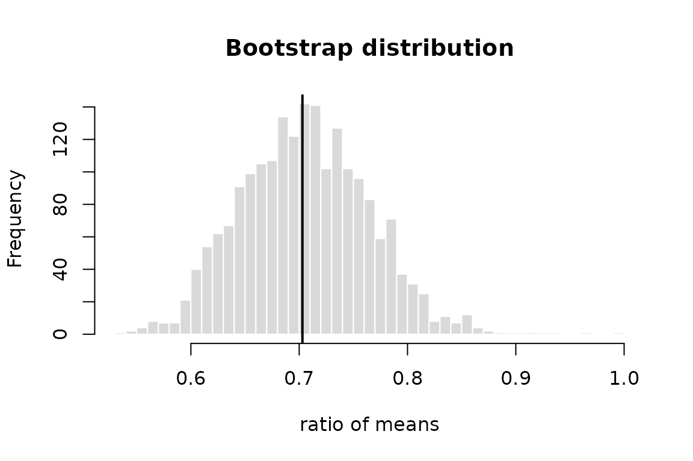

# Resampling inference and effect sizes

``` r

library(RDataScienceCompendium)
```

This vignette shows how to quantify uncertainty without relying on
distributional assumptions (bootstrap intervals and permutation tests),
and how to report the *size* of an effect together with an exact
interval.

## Bootstrap confidence intervals

Consider the ratio of mean fuel consumption between automatic and manual
cars in `mtcars`. The ratio has no simple standard error, but the
nonparametric bootstrap gives one directly. For a statistic of a data
frame,
[`boot_ci()`](https://satvikpraveen.github.io/R-Data-Science-Compendium/reference/boot_ci.md)
resamples rows.

``` r

ratio <- function(d) mean(d$mpg[d$am == 0]) / mean(d$mpg[d$am == 1])
ci <- boot_ci(mtcars, ratio, R = 1999, seed = 2024)
ci
#> Nonparametric bootstrap confidence intervals
#> n = 32, R = 1999 replicates
#> 
#> Estimate: 0.703  (bias 0.002727, SE 0.05936)
#> 
#>        type level  lower  upper
#>  percentile   95% 0.5996 0.8215
#>       basic   95% 0.5845 0.8063
#>      normal   95% 0.5839 0.8166
#>         bca   95% 0.5961 0.8165
```

The four methods rest on different assumptions (Davison and Hinkley
1997):

- **percentile**: quantiles of the bootstrap distribution. It is
  transformation-respecting but only first-order accurate.
- **basic**: reflects the percentile interval around the estimate.
- **normal**: estimate minus bootstrap bias, plus or minus a normal
  quantile times the bootstrap SE.
- **BCa**: corrects the percentile interval for median bias
  ($`\hat z_0`$) and for skewness via the acceleration $`\hat a`$(Efron
  1987). It is second-order accurate and usually preferred.

``` r

c(bias_correction = ci$bias_correction, acceleration = ci$acceleration)
#> bias_correction    acceleration 
#>    -0.038254532    -0.003122252
hist(ci$replicates, breaks = 40, main = "Bootstrap distribution",
     xlab = "ratio of means", col = "grey85", border = "white")
abline(v = ci$estimate, lwd = 2)
```



[`boot_ci()`](https://satvikpraveen.github.io/R-Data-Science-Compendium/reference/boot_ci.md)
reproduces
[`boot::boot.ci()`](https://rdrr.io/pkg/boot/man/boot.ci.html) to
machine precision given the same seed (see the package tests). What it
adds is a small, validated interface and a guarantee that the caller’s
random number stream is not changed.

## Permutation tests

A permutation test gives an exact test of the null hypothesis that the
group labels are exchangeable. With 13 manual and 19 automatic cars
there are $`\binom{32}{13} \approx 3.5 \times 10^{8}`$ rearrangements,
far too many to enumerate, so
[`perm_test()`](https://satvikpraveen.github.io/R-Data-Science-Compendium/reference/perm_test.md)
draws a random sample of them:

``` r

manual <- mtcars$mpg[mtcars$am == 1]
auto <- mtcars$mpg[mtcars$am == 0]
pt <- perm_test(manual, auto, R = 9999, seed = 1)
pt
#> 
#>  Monte Carlo two-sample permutation test
#> 
#> data:  manual and auto
#> T = 7.2449, rearrangements = 9999, p-value = 3e-04
#> alternative hypothesis: true location shift is not equal to 0
pt$p.value.mcse
#> [1] 0.0001731878
```

The p-value is computed as $`(b + 1)/(R + 1)`$, never as $`b/R`$. The
$`b/R`$ estimator can return zero, and the test built on it is
anti-conservative (Phipson and Smyth 2010). Any statistic can be used,
such as a difference in medians:

``` r

perm_test(manual, auto, statistic = function(x, y) median(x) - median(y),
          R = 9999, seed = 1)$p.value
#> [1] 0.0189
```

When the reference set is small, the test is exact. In the paired
`sleep` data there are $`2^{10} = 1024`$ sign flips:

``` r

perm_test(sleep$extra[1:10], sleep$extra[11:20], paired = TRUE)
#> 
#>  Exact paired sign-flip randomisation test
#> 
#> data:  sleep$extra[1:10] and sleep$extra[11:20]
#> T = -1.58, rearrangements = 1024, p-value = 0.003906
#> alternative hypothesis: true location is not equal to 0
```

## Effect sizes with exact intervals

A p-value says nothing about the magnitude of an effect. Standardised
mean differences do, but their commonly reported large-sample intervals
can be badly wrong in small samples.
[`cohens_d()`](https://satvikpraveen.github.io/R-Data-Science-Compendium/reference/effect_sizes.md)
and
[`hedges_g()`](https://satvikpraveen.github.io/R-Data-Science-Compendium/reference/effect_sizes.md)
invert the noncentral $`t`$ distribution instead (Steiger and Fouladi
1997; Cumming and Finch 2001):

``` r

hedges_g(manual, auto)
#> Hedges' g (independent samples)
#>   estimate = 1.441, 95% CI [0.6536, 2.209]
#>   df = 30, n = 13 + 19
cohens_d(sleep$extra[1:10], sleep$extra[11:20], paired = TRUE)
#> Cohen's d (paired (d_z))
#>   estimate = -1.285, 95% CI [-2.118, -0.4146]
#>   df = 9, n = 10
```

Hedges’ $`g`$ applies the exact correction $`J(\nu)`$, which removes the
upward bias of $`d`$ in small samples (Hedges 1981):

``` r

round(hedges_correction(c(5, 10, 20, 50, 100)), 4)
#> [1] 0.8407 0.9227 0.9619 0.9849 0.9925
```

## References

Cumming, Geoff, and Sue Finch. 2001. “A Primer on the Understanding,
Use, and Calculation of Confidence Intervals That Are Based on Central
and Noncentral Distributions.” *Educational and Psychological
Measurement* 61 (4): 532–74. <https://doi.org/10.1177/0013164401614002>.

Davison, A. C., and D. V. Hinkley. 1997. *Bootstrap Methods and Their
Application*. Cambridge University Press.
<https://doi.org/10.1017/CBO9780511802843>.

Efron, Bradley. 1987. “Better Bootstrap Confidence Intervals.” *Journal
of the American Statistical Association* 82 (397): 171–85.
<https://doi.org/10.1080/01621459.1987.10478410>.

Hedges, Larry V. 1981. “Distribution Theory for Glass’s Estimator of
Effect Size and Related Estimators.” *Journal of Educational Statistics*
6 (2): 107–28. <https://doi.org/10.3102/10769986006002107>.

Phipson, Belinda, and Gordon K. Smyth. 2010. “Permutation P-Values
Should Never Be Zero: Calculating Exact P-Values When Permutations Are
Randomly Drawn.” *Statistical Applications in Genetics and Molecular
Biology* 9 (1). <https://doi.org/10.2202/1544-6115.1585>.

Steiger, James H., and Rachel T. Fouladi. 1997. “Noncentrality Interval
Estimation and the Evaluation of Statistical Models.” In *What If There
Were No Significance Tests?*, edited by L. L. Harlow, S. A. Mulaik, and
J. H. Steiger. Erlbaum.
